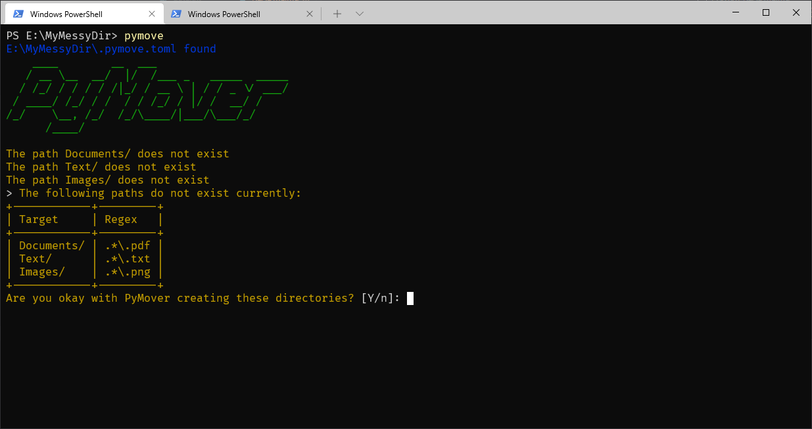
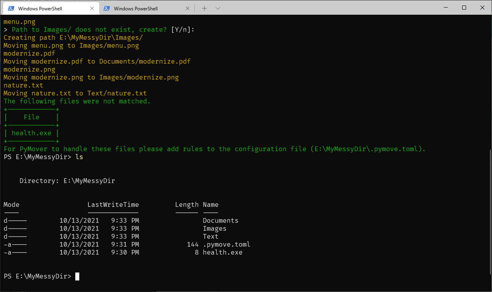

# PyMove

PyMove is a command line tool for automatically organizing files within
directories using toml files.

I use this to help manage directories that frequently get a bunch of random
files... _cough cough_ Downloads

## Images

 

